# Dự án phát hiện bệnh trên lá cây khoai tây với XAI và trực quan hóa 3d kết quả
- Sử dụng các mô hình AI để thực huấn luyện phân loại ba nhãn bệnh trên lá cây khoai tây (có cả ảnh khỏe mạnh)
- Tập dữ liệu là các ảnh lá khoai tây được tổng hợp từ 4 tập dữ liệu khác, được chia sẵn cho train/val/test 
- Lưu ý
    - Các đường dẫn trong các file .ipynb sẽ khác đối với mọi người
## Mục lục
- [Import](#chuẩn-bị)
- [Dữ liệu](#dữ-liệu)
- [Mô hình](#mô-hình-và-huấn-luyện)
- [Huấn luyện](#huấn-luyện)
- [Kết quả và đánh giá](#kết-quả-và-đánh-giá)
## Chuẩn bị
### Các thư viện cần thiết
- os: hỗ trợ truy xuất dữ liệu trong thư mục
- time: quản lý thời gian huấn luyện mô hình
- random: hỗ trợ lấy mẫu ngẫu nhiên để kiểm thử
- Numpy : thống kê quá trình huấn luyện
- Pandas : thống kê dữ liệu
- Các thư viện từ scikit-learn(sklearn) và matplotlib: vẽ và hỗ trợ vẽ biểu đồ đánh giá
- skimage: Một vài xử lý trên ảnh
- Các thư viện từ Pytorch: Hổ trợ dựng mô hình, xử lý bộ dữ liệu
- timm: là thư viện chứa rất nhiều mô hình được huấn luyện sẵn
- lime: Để sử dụng XAI(LIME)
- skfuzzy: hỗ trợ xử lý logic mờ
### Các hàm sử dụng
- Thực hiện và quản lý huấn luyện:
    - train
    - visualize_results
- Sử dụng XAI
    - GradCAM
    - display_gradcam
    - LimeHybridViTExplainer
- Chuẩn hóa dữ liệu
    - get_pil_transform
    - get_preprocess_transform
- Cắt bớt nền
    - fz_fn_segment_fc
## Dữ liệu
### Mô tả
- Bộ dữ liệu là các ảnh chụp lá khoai tây có ba nhãn (Early Blight, Late Blight, Healthy) tổng có khoảng 6296 ảnh, Bộ dữ liệu này được tổng hợp từ PlanDoc, PlantVillage, Potato Disease Leaf Dataset(PLD). PlantVillage,
- URL của Bộ dữ liệu: [Collect_Leaf_Potato_Data](https://www.kaggle.com/datasets/hunhphcc/collect-leaf-potato-data)
### Chia dữ liệu
- Bộ dữ liệu được chia sẵn :
    - Train: 4349
    - Validation: 1100
    - Test: 847
## Mô hình và huấn luyện
### Các mô hình
- Các mô hình được sử dụng
    - MobileNetV3
    - Vision Transformer
    - MobileNetV3 + Vision Transformer
    - MobileNetV3 + Vision Transformer + Anfis(Mô hình logic mờ với ảnh)
### Huấn luyện
- Các tham số huấn luyện
    - Hàm tối ưu: AdamW
    - Hàm mất mát: CrossEntropyLoss
    - Batch size: 64
    - Epoch tối đa: 30
    - Đợi: tối đa 3 epoch đối vội dừng huấn luyện sau khi mô hình không cải thiện
- MobileNetV3:
    - Huấn luyện dừng ở epoch thứ 11
    - Thời gian tiêu tốn 373 giây
- Vision Transformer:
    - Huấn luyện dừng ở epoch thứ 12
    - Thời gian tiêu tốn 1353 giây
- MobileNetV3 + Vision Transformer:
    - Huấn luyện dừng ở epoch thứ 12
    - Thời gian tiêu tốn 584 giây
- MobileNetV3 + Vision Transformer + Anfis:
    - Huấn luyện dừng ở epoch thứ 11
    - Thời gian tiêu tốn 2400 giây
## Kết quả và đánh giá
- Kết quả huấn luyện:
    - MobileNetV3:
    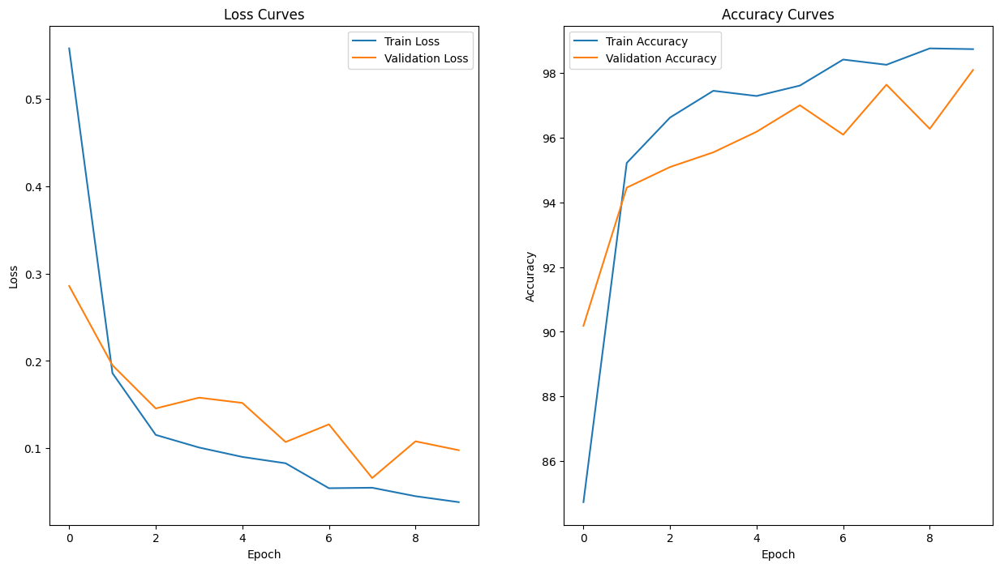
    - Vision Transformer
    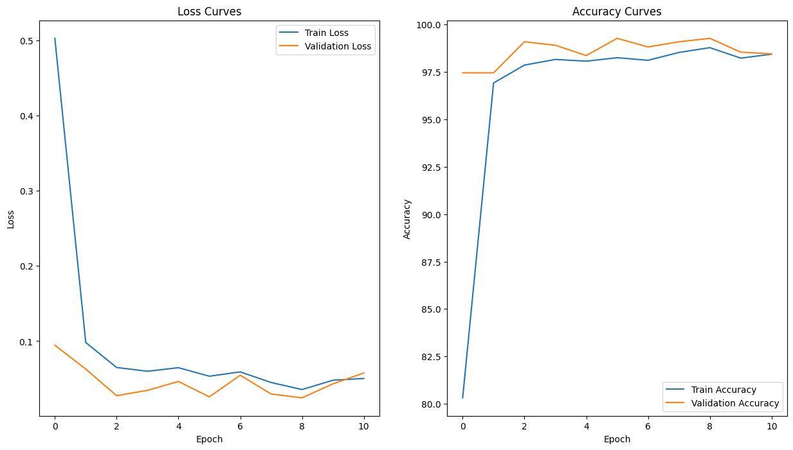
    - MobileNetV3 + Vision Transformer
    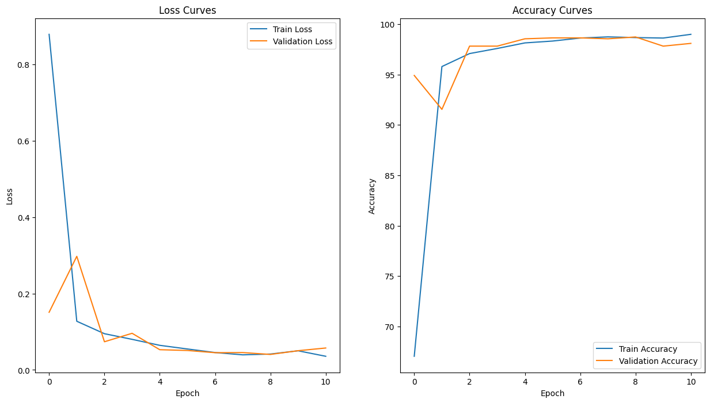
    - MobileNetV3 + Vision Transformer + Anfis
    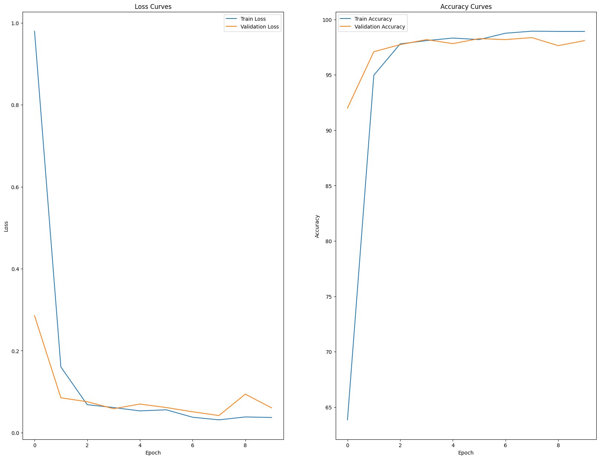
- Ma trận nhầm lẫn:
    - MobileNetV3:
      ***
      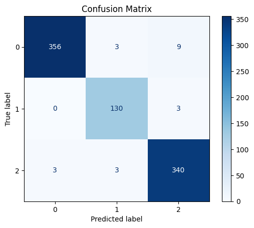
    - Vision Transformer:
      ***
    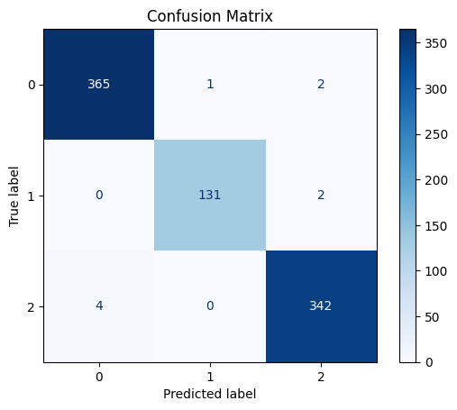
    - MobileNetV3 + Vision Transformer:
      ***
    
    - MobileNetV3 + Vision Transformer + Anfis:
      ***
    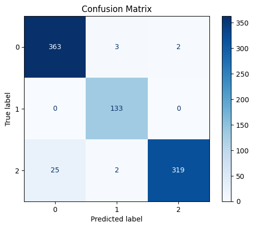
- Kết quả kiểm thử:
    - MobileNetV3:
      ***
    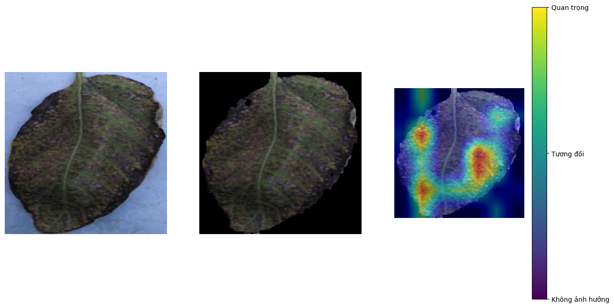
    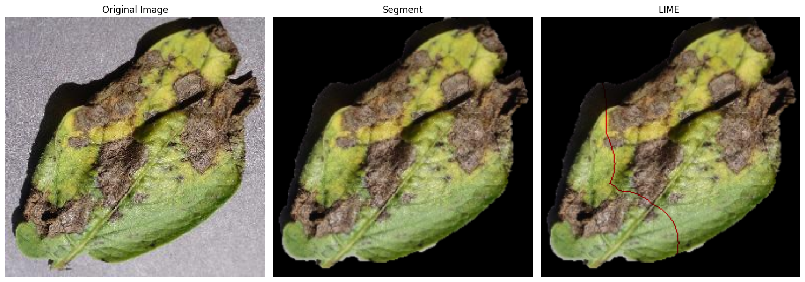
    - Vision Transformer:
      ***
    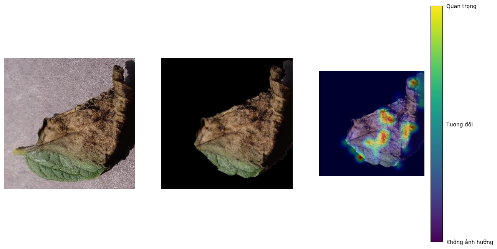
    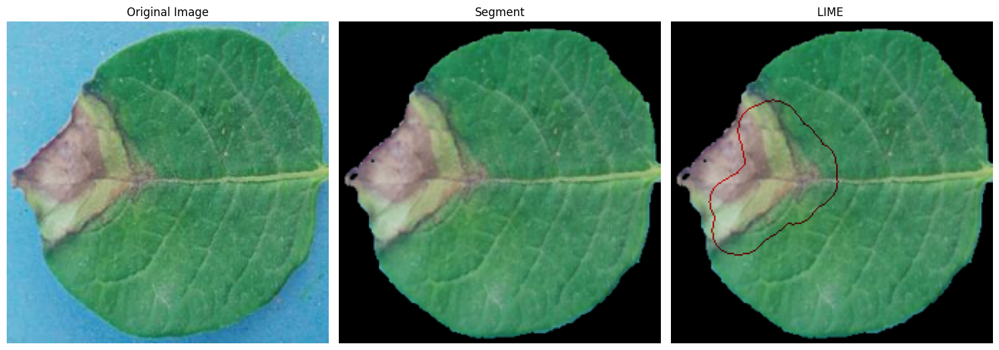
    - MobileNetV3 + Vision Transformer:
      ***
    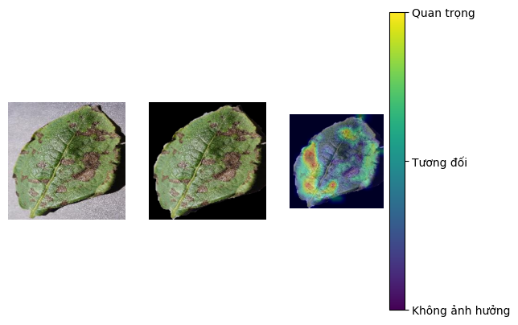
    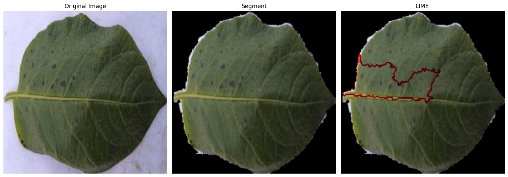
    - MobileNetV3 + Vision Transformer + Anfis:
      ***
    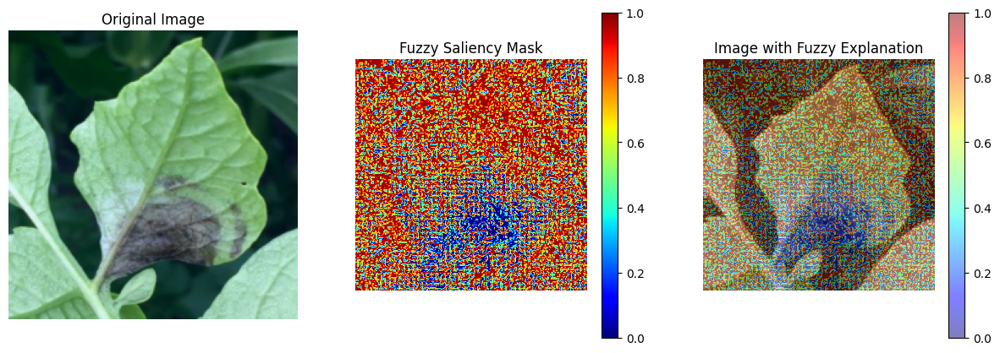
- Kết quả 3D hóa với zero123 và vfusion trong thư mục obj3d
    
    
